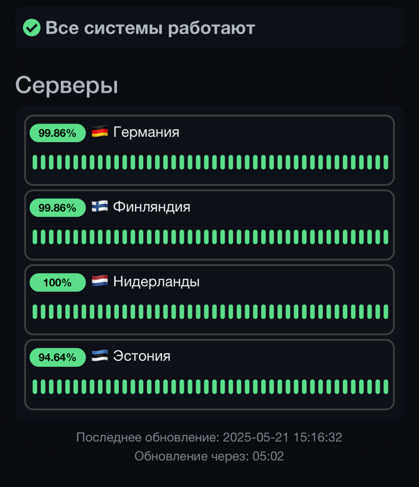

<a href="https://github.com/distillium/kuma-template">
 <picture>
   <source media="(prefers-color-scheme: dark)" srcset="./media/logo.png" />
   <source media="(prefers-color-scheme: light)" srcset="./media/logo-black.png" />
   
 </picture>
</a>

Copy the contents of the kuma.css file and place it in the settings of the status page

